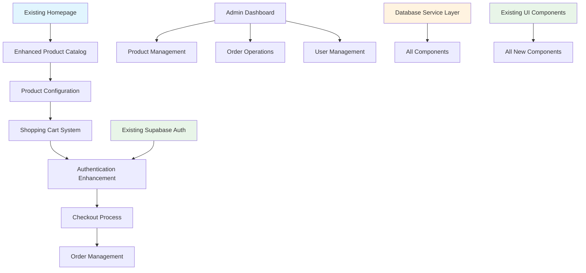

# Custom E-commerce Printing Platform Brownfield Enhancement Architecture

## Introduction

This document outlines the architectural approach for enhancing the Custom E-commerce Printing Platform with comprehensive e-commerce functionality, focusing specifically on the database schema foundation and implementation strategy. Its primary goal is to serve as the guiding architectural blueprint for AI-driven development of new features while ensuring seamless integration with the existing React/TypeScript/Supabase system.

**Relationship to Existing Architecture:**
This document supplements the existing System Architecture document by providing specific implementation details for Supabase PostgreSQL schema creation, Row Level Security policies, and integration patterns that maintain compatibility with the current React/TypeScript frontend setup.

### Existing Project Analysis

**Current Project State:**

- **Primary Purpose:** E-commerce printing platform foundation with basic React homepage
- **Current Tech Stack:** React 18, TypeScript, Vite, Tailwind CSS, Shadcn/UI, Supabase (PostgreSQL + Auth + Storage)
- **Architecture Style:** Backend-as-a-Service (BaaS) with client-side React application
- **Deployment Method:** Frontend to Vercel/Netlify, Supabase for backend services

**Available Documentation:**

- Comprehensive Project Brief with business requirements and vendor-broker model
- Frontend Architecture document with React/TypeScript patterns and component structure
- System Architecture document with detailed database schema design
- UI/UX Specification with complete design system and user flows
- Recently created comprehensive PRD with 12-story implementation plan

**Identified Constraints:**

- Must maintain existing Supabase Auth integration without disruption
- All new components must use existing Shadcn/UI and Tailwind CSS patterns
- Database changes must be additive (no breaking changes to existing tables)
- Must follow existing TypeScript strict mode and ESLint configurations

### Change Log

| Change | Date | Version | Description | Author |
| ------ | ---- | ------- | ----------- | ------ |
| Initial Architecture | 2025-07-04 | 1.0 | Brownfield database schema implementation architecture | Winston (Architect) |

## Enhancement Scope and Integration Strategy

### Enhancement Overview

**Enhancement Type:** Major Feature Addition with System Integration
**Scope:** Complete e-commerce platform transformation with database foundation, product catalog, pricing engine, order management, CRM, and marketing automation
**Integration Impact:** Major Impact - Requires comprehensive database schema, new API endpoints, and extensive frontend enhancements

### Integration Approach

**Code Integration Strategy:** Extend existing React/TypeScript patterns with new feature modules in src/features/ directory, maintaining existing component library and state management patterns

**Database Integration:** Additive schema approach - create new tables for e-commerce functionality while preserving existing Supabase Auth tables and relationships

**API Integration:** Build new REST endpoints following existing patterns, integrate with Supabase Edge Functions for complex business logic, maintain existing authentication middleware

**UI Integration:** Enhance existing homepage and navigation with dynamic data, create new page components using established Shadcn/UI patterns and Tailwind styling

### Compatibility Requirements

- **Existing API Compatibility:** New endpoints must follow /api/v1/ pattern and use existing authentication
- **Database Schema Compatibility:** New tables must not modify existing auth.users or storage schemas
- **UI/UX Consistency:** All new components must use existing design tokens and component patterns
- **Performance Impact:** Maintain existing load times while adding real-time pricing and dynamic content

## Tech Stack Alignment

### Existing Technology Stack

| Category           | Current Technology | Version     | Usage in Enhancement | Notes     |
| :----------------- | :----------------- | :---------- | :------------------- | :-------- |
| **Language**       | TypeScript        | Latest      | All new code        | Strict mode maintained |
| **Runtime**        | Node.js           | 18+         | Supabase functions  | Via Supabase Edge Runtime |
| **Framework**      | React             | 18          | All frontend components | With existing hooks patterns |
| **Database**       | PostgreSQL        | 15          | Core data storage   | Via Supabase managed instance |
| **API Style**      | REST              | v1          | New endpoints       | Extending existing patterns |
| **Authentication** | Supabase Auth     | Latest      | User management     | Integration with new user types |
| **Testing**        | Not configured    | -           | To be implemented   | Following frontend patterns |
| **Build Tool**     | Vite              | Latest      | Development/build   | Extending existing config |

### New Technology Additions

| Technology   | Version     | Purpose     | Rationale     | Integration Method |
| :----------- | :---------- | :---------- | :------------ | :----------------- |
| React Query  | Latest      | Server state management | Already configured, extending for API calls | Use existing setup |
| Zod          | Latest      | Schema validation | Already available, extend for new schemas | Use existing patterns |

## Data Models and Schema Changes

### New Data Models

### Users Enhancement

**Purpose:** Extend existing Supabase auth.users with e-commerce specific fields
**Integration:** Create profiles table linked to auth.users via foreign key

**Key Attributes:**

- user_id: UUID - Links to auth.users.id
- is_broker: BOOLEAN - Identifies broker accounts
- broker_category_discounts: JSONB - Category-specific discount configuration
- company_name: TEXT - Business name for broker accounts
- phone: TEXT - Contact information
- created_at: TIMESTAMPTZ - Profile creation timestamp
- updated_at: TIMESTAMPTZ - Last modification timestamp

**Relationships:**

- **With Existing:** One-to-one with auth.users
- **With New:** One-to-many with orders

### Product Categories

**Purpose:** Hierarchical product organization supporting sub-categories
**Integration:** Standalone table with self-referencing parent relationship

**Key Attributes:**

- id: UUID - Primary key
- name: TEXT - Category display name
- slug: TEXT - URL-friendly identifier
- description: TEXT - Category description
- parent_category_id: UUID - Self-reference for sub-categories
- default_broker_discount: DECIMAL(5,2) - Default broker discount percentage
- sort_order: INTEGER - Display ordering
- is_active: BOOLEAN - Visibility control

**Relationships:**

- **With Existing:** None
- **With New:** One-to-many with products, self-referencing for hierarchy

### Products

**Purpose:** Core product catalog with vendor relationships
**Integration:** Links to categories and vendors

**Key Attributes:**

- id: UUID - Primary key
- name: TEXT - Product display name
- slug: TEXT - URL-friendly identifier
- description: TEXT - Product description
- category_id: UUID - Foreign key to product_categories
- vendor_id: UUID - Foreign key to vendors
- base_price: DECIMAL(10,2) - Starting price for calculations
- is_active: BOOLEAN - Availability control
- minimum_quantity: INTEGER - Minimum order quantity

**Relationships:**

- **With Existing:** None
- **With New:** Many-to-one with categories and vendors, many-to-many with paper_stocks, print_sizes, etc.

### Schema Integration Strategy

**Database Changes Required:**

- **New Tables:** 15 core tables + 6 junction tables for many-to-many relationships
- **Modified Tables:** None (purely additive approach)
- **New Indexes:** Performance indexes on foreign keys, search fields, and frequently queried columns
- **Migration Strategy:** Incremental deployment with rollback capability

**Backward Compatibility:**

- All existing auth.users functionality preserved
- No modifications to existing Supabase Auth or Storage schemas
- New user_profiles table extends rather than replaces user data

## Component Architecture

### New Components

### Database Service Layer

**Responsibility:** Supabase database operations and schema management
**Integration Points:** Extends existing src/integrations/supabase/ patterns

**Key Interfaces:**

- Database schema creation and migration functions
- Type-safe query builders using existing Supabase client
- Row Level Security policy management

**Dependencies:**

- **Existing Components:** src/integrations/supabase/client.ts, src/integrations/supabase/types.ts
- **New Components:** API service layer for business logic

**Technology Stack:** TypeScript, Supabase client, existing error handling patterns

### Product Catalog Components

**Responsibility:** Product display, configuration, and browsing interfaces
**Integration Points:** Enhances existing homepage categories, integrates with navigation

**Key Interfaces:**

- ProductCatalog component for category listings
- ProductDetail component for configuration interface
- ProductConfiguration hook for pricing calculations

**Dependencies:**

- **Existing Components:** Existing UI components, React Query setup, routing
- **New Components:** Shopping cart, pricing engine

**Technology Stack:** React, TypeScript, Shadcn/UI, React Query, existing form patterns

### Component Interaction Diagram



## API Design and Integration

### New API Endpoints

**API Integration Strategy:** Extend existing patterns with /api/v1/ prefix, maintain RESTful conventions
**Authentication:** Integrate with existing Supabase Auth middleware and session management
**Versioning:** Follow existing v1 pattern, plan for v2 if breaking changes needed

#### Product Catalog API

- **Method:** GET
- **Endpoint:** /api/v1/products
- **Purpose:** Retrieve product listings with filtering and pagination
- **Integration:** Extends existing API patterns with consistent error handling

**Request:**
```json
{
  "category": "string",
  "page": "number",
  "limit": "number",
  "filters": "object"
}
```

**Response:**
```json
{
  "success": true,
  "data": {
    "products": ["array"],
    "pagination": "object",
    "filters": "object"
  }
}
```

## Source Tree Integration

### Existing Project Structure

```plaintext
src/
├── components/
│   └── ui/                    # Existing Shadcn/UI components
├── hooks/                     # Existing custom hooks
├── integrations/
│   └── supabase/             # Existing Supabase setup
├── lib/                      # Existing utilities
└── pages/                    # Existing page components
```

### New File Organization

```plaintext
src/
├── components/
│   ├── ui/                   # Existing Shadcn/UI components
│   └── common/               # New: Composed components
├── features/                 # New: Feature-based organization
│   ├── products/
│   ├── cart/
│   ├── orders/
│   ├── auth/
│   └── admin/
├── api/                     # New: API service layer
├── integrations/
│   ├── supabase/           # Existing Supabase setup
│   └── payments/           # New: Payment integrations
├── lib/                    # Existing utilities + new
└── types/                # New: Global TypeScript types
```

## Infrastructure and Deployment Integration

### Existing Infrastructure

**Current Deployment:** Vite build to Vercel/Netlify with Supabase backend
**Infrastructure Tools:** Vite build system, Supabase CLI, Git-based deployment
**Environments:** Development (local), Staging (Supabase staging), Production (Supabase production)

### Enhancement Deployment Strategy

**Deployment Approach:** Maintain existing frontend deployment pipeline, add database migrations
**Infrastructure Changes:** New Supabase Edge Functions for complex business logic
**Pipeline Integration:** Extend existing build process with database migration checks

## Risk Assessment and Mitigation

### Technical Risks

**Risk:** Database schema migration complexity affecting existing authentication
**Impact:** High
**Likelihood:** Medium
**Mitigation:** Thorough testing in staging environment, rollback procedures, incremental deployment

**Risk:** Real-time pricing calculations causing performance issues
**Impact:** Medium
**Likelihood:** Medium
**Mitigation:** Implement caching layer, optimize database queries, use background processing

### Monitoring and Alerting

**Enhanced Monitoring:** Database performance metrics, API response times, error rates
**New Alerts:** Payment processing failures, order creation errors, file upload issues
**Performance Monitoring:** Real-time pricing calculation times, product search performance

## Next Steps

### Story Manager Handoff

**Architecture Complete:** This brownfield architecture document provides comprehensive implementation guidance for Story 1.1 (Database Schema Foundation Setup) and establishes patterns for all subsequent stories.

**First Story Implementation:** Begin with Story 1.1 - Database Schema Foundation Setup with clear integration checkpoints to verify existing system remains intact.

### Developer Handoff

**Implementation Ready:** This architecture document provides specific technical guidance for implementing the database schema while respecting existing codebase patterns.

**Key Technical Decisions:** 
- Supabase PostgreSQL for all new tables with proper RLS policies
- Feature-based organization in src/features/ for new components
- Additive database approach preserving existing auth.users table
- REST API endpoints following existing /api/v1/ patterns

**Implementation Sequencing:** Start with database schema creation, then API endpoints, followed by React components to minimize risk to existing functionality.